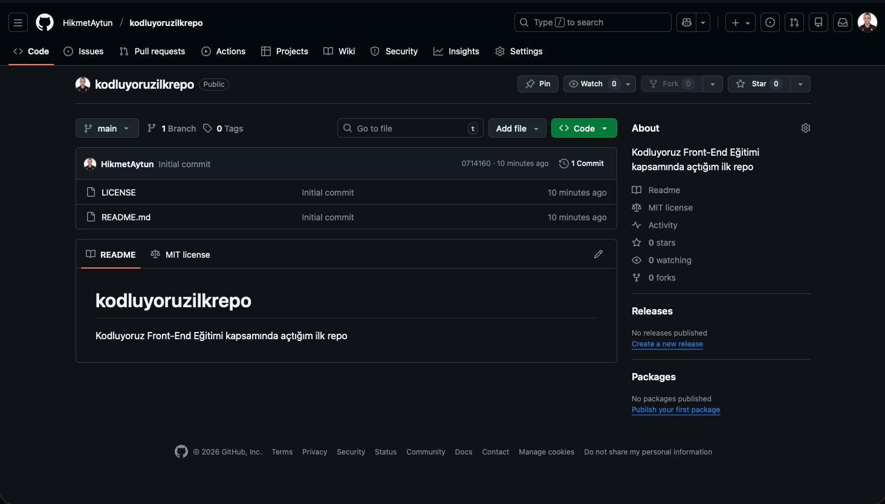

<h1>Kodluyoruz Ilk Repo</h1>

Kodluyoruz Front-End Eğitimi kapsamında açtığım ilk repo

<h2>Installation</h2>

Öncelikle projeyi clonelayın. (Buraya sizin reponuzdan aldığınız link gelecek)

<h2>Usage</h2>

Projeyi cloneladıktan sonra Visual Studio Code programında açınız.

<h2>Contributing</h2>

Pull requestler kabul edilir. Büyük değişiklikler için, lütfen önce neyi değiştirmek istediğinizi tartışmak için bir konu açınız.

<h2>License</h2>

MIT